PAC1
================
Albert Costas Gutierrez
15 de abril 2018

------------------------------------------------------------------------

Carregar el fitxer de dades en R
================================

------------------------------------------------------------------------

En obrir el fitxer amb un editor de text senzill com el bloc de notes, gedit o VIM per Linux. Llavors es pot veure que "," és el símbol separador i el punt la coma decimal, a més del caràcter de quota ". Per tant s'ha de llegir el fitxer amb la funció `read.csv2(file = "2016_raw.csv", header = TRUE, sep = ",", quote = "\"", dec = ",", fill = TRUE)`

| Country     | Region         |  Happiness.Rank| Happiness.Score |  Lower.Confidence.Interval|  Upper.Confidence.Interval| GDP.per.Capita |   Family|  Life.Expectancy|  Freedom|  Government.Corruption|  Generosity|  Dystopia.Residual|
|:------------|:---------------|---------------:|:----------------|--------------------------:|--------------------------:|:---------------|--------:|----------------:|--------:|----------------------:|-----------:|------------------:|
| denmark     | WESTERN EUROPE |               1| 7.526           |                      7.460|                      7.592| 1.44178        |  1.16374|          0.79504|  0.57941|                0.44453|     0.36171|            2.73939|
| switzerland | WESTERN EUROPE |              61| 7,509           |                      7.428|                      7.590| 1.52733        |  1.14524|          0.86303|  0.58557|                0.41203|     0.28083|            2.69463|
| iceland     | WESTERN EUROPE |               3| 7.501           |                      7.333|                      7.669| 1.42666        |       NA|          0.86733|  0.56624|                0.14975|     0.47678|            2.83137|
| norway      | WESTERN EUROPE |               4| 7.498           |                      7.421|                      7.575| 1.57744        |  1.12690|          0.79579|  0.59609|                0.35776|     0.37895|            2.66465|
| finland     | WESTERN EUROPE |               5| 7.413           |                      7.351|                      7.475| 1.40598        |  1.13464|          0.81091|  0.57104|                0.41004|     0.25492|            2.82596|

El fitxer de dades recull informació sobre regions de diversos països, disposem d'atributs relatius el rank i la puntuació de la facilitat, la renda per capita, expectativa de vida, corrupció, ...

Conté 157 registres i 13 variables. Les variables són Country, Region, Happiness.Rank, Happiness.Score, Lower.Confidence.Interval, Upper.Confidence.Interval, GDP.per.Capita, Family, Life.Expectancy, Freedom, Government.Corruption, Generosity, Dystopia.Residual.

------------------------------------------------------------------------

Canviar els noms de les variables
=================================

------------------------------------------------------------------------

``` r
defineAtribute <- function(atribute) {
  textSplited <- strsplit(atribute, "[.]")[[1]]
  if (1 < length(textSplited)) {
    atributeFinal <- ""
    for (item in textSplited) {
      atributeFinal <-
        paste(atributeFinal, toupper(substr(item, 1, 1)), sep = "")
    }
    atributeFinal
  } else {
    atribute
  }
}

iterator <- 1
for (item in names(mydata)) {
  names(mydata)[iterator] <- print(defineAtribute(item))
  iterator <- iterator + 1
}
```

    ## [1] "Country"
    ## [1] "Region"
    ## [1] "HR"
    ## [1] "HS"
    ## [1] "LCI"
    ## [1] "UCI"
    ## [1] "GPC"
    ## [1] "Family"
    ## [1] "LE"
    ## [1] "Freedom"
    ## [1] "GC"
    ## [1] "Generosity"
    ## [1] "DR"

``` r
kable(names(mydata))
```

| x          |
|:-----------|
| Country    |
| Region     |
| HR         |
| HS         |
| LCI        |
| UCI        |
| GPC        |
| Family     |
| LE         |
| Freedom    |
| GC         |
| Generosity |
| DR         |

``` r
toString(names(mydata))
```

    ## [1] "Country, Region, HR, HS, LCI, UCI, GPC, Family, LE, Freedom, GC, Generosity, DR"

------------------------------------------------------------------------

Indicar el tipus de variable estadástica en cada variable
=========================================================

------------------------------------------------------------------------

Són variables qualitatives nominals, ja que no es poden ordenar: Country, Region

Són variables quantitatives discretes, són nombres enters en aquest cas el rang de felicitat: Happiness.Rank

Són variables quantitatives contínues, es tracta de números amb decimals: Happiness.Score, GDP.per.Capita, Lower.Confidence.Interval, Upper.Confidence.Interval, Family, Life.Expectancy, Freedom, Government.Corruption, Generosity, Dystopia.Residual

------------------------------------------------------------------------

Assignar a cada variable el tipus de variable R adequat
=======================================================

------------------------------------------------------------------------

Quan llegim el fitxer amb la funció `read.csv2()` podem veure que els formats coincideixen amb els que em definit anteriorment, menys HR i HPC

Per tant hem de corregir, l'assignació a realitzar és:

``` r
kable(data.frame(variables= n.var[c(4,7)], clase= c("numeric", "numeric")))
```

| variables       | clase   |
|:----------------|:--------|
| Happiness.Score | numeric |
| GDP.per.Capita  | numeric |

``` r
res <- sapply(mydata,class)
kable(data.frame(variables=names(res),clase=as.vector(res)))
```

| variables  | clase   |
|:-----------|:--------|
| Country    | factor  |
| Region     | factor  |
| HR         | integer |
| HS         | factor  |
| LCI        | numeric |
| UCI        | numeric |
| GPC        | factor  |
| Family     | numeric |
| LE         | numeric |
| Freedom    | numeric |
| GC         | numeric |
| Generosity | numeric |
| DR         | numeric |

``` r
toString(data.frame(variables=names(res),clase=as.vector(res)))
```

    ## [1] "c(1, 12, 8, 9, 10, 13, 7, 3, 11, 4, 5, 6, 2), c(1, 1, 2, 1, 3, 3, 1, 3, 3, 3, 3, 3, 3)"

------------------------------------------------------------------------

Corregir errors de variables quantitatives amb confusió de separador decimal.
=============================================================================

------------------------------------------------------------------------

Pel que fa a les variables quantitatives si hi ha una confusió del separador decimal, alguns registres hem vist que tenen comà en lloc de punt.

``` r
# Passa tot a . decimal que entán R
# quan es guardi com a csv2 quedarà com , decimal
mydata$HS <- as.numeric(sub(",", "\\.", mydata$HS))
mydata$LCI <- as.numeric(sub(",", "\\.", mydata$LCI))
mydata$UCI <- as.numeric(sub(",", "\\.", mydata$UCI))
mydata$GPC <- as.numeric(sub(",", "\\.", mydata$GPC))
mydata$Family <- as.numeric(sub(",", "\\.", mydata$Family))
mydata$LE <- as.numeric(sub(",", "\\.", mydata$LE))
mydata$Freedom <- as.numeric(sub(",", "\\.", mydata$Freedom))
mydata$GC <-  as.numeric(sub(",", "\\.", mydata$GC))
mydata$Generosity <- as.numeric(sub(",", "\\.", mydata$Generosity))
mydata$DR <- as.numeric(sub(",", "\\.", mydata$DR))

summary(mydata)
```

    ##             Country                                Region  
    ##    afghanistan  :  1   SUB-SAHARAN AFRICA             :16  
    ##    australia    :  1   LATIN AMERICA AND CARIBBEAN    :11  
    ##    azerbaijan   :  1   CENTRAL AND EASTERN EUROPE     :10  
    ##    bangladesh   :  1   MIDDLE EAST AND NORTHERN AFRICA:10  
    ##    benin        :  1     CENTRAL AND EASTERN EUROPE   : 9  
    ##    bhutan       :  1     SUB-SAHARAN AFRICA           : 9  
    ##  (Other)        :151   (Other)                        :92  
    ##        HR               HS             LCI             UCI       
    ##  Min.   :  1.00   Min.   :2.905   Min.   :2.732   Min.   :3.078  
    ##  1st Qu.: 40.00   1st Qu.:4.404   1st Qu.:4.417   1st Qu.:4.465  
    ##  Median : 79.00   Median :5.314   Median :5.308   Median :5.419  
    ##  Mean   : 78.98   Mean   :5.382   Mean   :5.359   Mean   :5.482  
    ##  3rd Qu.:118.00   3rd Qu.:6.269   3rd Qu.:6.288   3rd Qu.:6.434  
    ##  Max.   :157.00   Max.   :7.526   Max.   :8.241   Max.   :7.669  
    ##                                                                  
    ##       GPC             Family             LE            Freedom      
    ##  Min.   :0.0000   Min.   :0.0000   Min.   :0.0000   Min.   :0.0000  
    ##  1st Qu.:0.6702   1st Qu.:0.6397   1st Qu.:0.3829   1st Qu.:0.2575  
    ##  Median :1.0278   Median :0.8378   Median :0.5966   Median :0.3975  
    ##  Mean   :0.9539   Mean   :0.7896   Mean   :0.5576   Mean   :0.3710  
    ##  3rd Qu.:1.2796   3rd Qu.:1.0110   3rd Qu.:0.7299   3rd Qu.:0.4845  
    ##  Max.   :1.8243   Max.   :1.1728   Max.   :0.9528   Max.   :0.6085  
    ##                   NA's   :2                                         
    ##        GC            Generosity           DR        
    ##  Min.   :0.00000   Min.   :0.0000   Min.   :0.8179  
    ##  1st Qu.:0.06126   1st Qu.:0.1546   1st Qu.:2.0317  
    ##  Median :0.10547   Median :0.2225   Median :2.2907  
    ##  Mean   :0.13762   Mean   :0.2426   Mean   :2.3258  
    ##  3rd Qu.:0.17554   3rd Qu.:0.3119   3rd Qu.:2.6646  
    ##  Max.   :0.50521   Max.   :0.8197   Max.   :3.8377  
    ## 

``` r
kable(head(mydata, n = 5))
```

| Country        | Region            |    HR|        HS|      LCI|       UCI|      GPC|   Family|       LE|  Freedom|       GC|  Generosity|       DR|
|:---------------|:------------------|-----:|---------:|--------:|---------:|--------:|--------:|--------:|--------:|--------:|-----------:|--------:|
| denmark        | WESTERN EUROPE    |     1|     7.526|    7.460|     7.592|  1.44178|  1.16374|  0.79504|  0.57941|  0.44453|     0.36171|  2.73939|
| switzerland    | WESTERN EUROPE    |    61|     7.509|    7.428|     7.590|  1.52733|  1.14524|  0.86303|  0.58557|  0.41203|     0.28083|  2.69463|
| iceland        | WESTERN EUROPE    |     3|     7.501|    7.333|     7.669|  1.42666|       NA|  0.86733|  0.56624|  0.14975|     0.47678|  2.83137|
| norway         | WESTERN EUROPE    |     4|     7.498|    7.421|     7.575|  1.57744|  1.12690|  0.79579|  0.59609|  0.35776|     0.37895|  2.66465|
| finland        | WESTERN EUROPE    |     5|     7.413|    7.351|     7.475|  1.40598|  1.13464|  0.81091|  0.57104|  0.41004|     0.25492|  2.82596|
| Podem veure qu | e ara tenim unifi |  cats|  tots els|  separad|  ors deci|    mals.|         |         |         |         |            |         |

------------------------------------------------------------------------

Normalitzar/Estandarditzar variables qualitatives.
==================================================

------------------------------------------------------------------------

Primer eliminen els primers espais en blanc al principi i al final:

``` r
# Treure espai abans i després
mydata$Country <- trimws(mydata$Country)
mydata$Region <- trimws(mydata$Region)
```

Normalitzem la primera lletra de cada paraula en majúscules i la resta en minúscules.

``` r
simpleCap <- function(x) {
  split_words <- strsplit(x, " ", fixed = TRUE)
  v <- c()
  for (word in split_words) {
    word = trimws(word)
    if (!is.null(word) && word != "") {
      v <- sapply(str_to_lower(word), upper_word)
    }
  }
  v =  v [!v == '']
  paste(v,  collapse = ' ')
}

upper_word <- function(x) {
  if (x != 'and')
    return(str_to_title(str_to_lower(x)))
  else
    return(str_to_lower(x))
}

mydata$Country = sapply(mydata$Country, simpleCap)
mydata$Region = sapply(mydata$Region, simpleCap)

kable(head(mydata$Country, n = 10))
```

| x           |
|:------------|
| Denmark     |
| Switzerland |
| Iceland     |
| Norway      |
| Finland     |
| Canada      |
| Netherlands |
| New Zealand |
| Australia   |
| Sweden      |

``` r
kable(table(mydata$Region))
```

| Var1                            |  Freq|
|:--------------------------------|-----:|
| Australia and New Zealand       |     2|
| Central and Eastern Europe      |    29|
| Eastern Asia                    |     6|
| Latin America and Caribbean     |    24|
| Middle East and Northern Afrca  |     5|
| Middle East and Northern Africa |    14|
| North America                   |     2|
| Southeastern Asia               |     9|
| Southern Asia                   |     7|
| Sub-Saharan Afrca               |    13|
| Sub-Saharan Africa              |    25|
| Western Europe                  |    21|

Podem veure que hi ha diverses faltes ortogràfiques, que afecten la feculència d'una zona, així com els diversos espais en blanc que podem alterar també la freqüència i obtenir resultat erronis, els corregim:

``` r
fixed_mistakes <- function(x) {
  word_with_mistake <- list('Afrca' = 'Africa')
  
  word_change <- function(word) {
    if (!is.null(word_with_mistake[[word]])) {
      word_with_mistake[[word]]
    } else{
      word
    }
  }
  
  split_words <- strsplit(x, " ", fixed = TRUE)
  v <- c()
  for (word in split_words) {
    word = trimws(word)
    if (!is.null(word) && word != "") {
      v <- sapply(stri_encode(word), word_change)
    }
  }
  v =  v [!v == '']
  paste(v,  collapse = ' ')
  
}

mydata$Region = sapply(mydata$Region, fixed_mistakes)

kable(table(mydata$Region))
```

| Var1                            |  Freq|
|:--------------------------------|-----:|
| Australia and New Zealand       |     2|
| Central and Eastern Europe      |    29|
| Eastern Asia                    |     6|
| Latin America and Caribbean     |    24|
| Middle East and Northern Africa |    19|
| North America                   |     2|
| Southeastern Asia               |     9|
| Southern Asia                   |     7|
| Sub-Saharan Africa              |    38|
| Western Europe                  |    21|

``` r
print(table(mydata$Region))
```

    ## 
    ##       Australia and New Zealand      Central and Eastern Europe 
    ##                               2                              29 
    ##                    Eastern Asia     Latin America and Caribbean 
    ##                               6                              24 
    ## Middle East and Northern Africa                   North America 
    ##                              19                               2 
    ##               Southeastern Asia                   Southern Asia 
    ##                               9                               7 
    ##              Sub-Saharan Africa                  Western Europe 
    ##                              38                              21

Les 2 funcions anteriors podríem unificar-les en 1 per no iterar 2 cops, si tinguéssim moltes dades, però en aquest la quantitat de registres o mostres no resulta un cost elevat de computació.

------------------------------------------------------------------------

Revisar possibles inconsistències entre variables.
==================================================

------------------------------------------------------------------------

Lower.Confidence.Interval vs Upper.Confidence.Interval
------------------------------------------------------

``` r
indices <- which(mydata$LCI >  mydata$UCI)
tmp <- mydata[indices, ]$UCI
mydata[indices, ]$UCI <- mydata[indices, ]$LCI
mydata[indices, ]$LCI <- tmp


head(mydata[, 5:6])
```

    ##     LCI   UCI
    ## 1 7.460 7.592
    ## 2 7.428 7.590
    ## 3 7.333 7.669
    ## 4 7.421 7.575
    ## 5 7.351 7.475
    ## 6 7.335 7.473

Ordenació per atribut HS y renombrament l'atribut HR amb l'ordre del HS.
------------------------------------------------------------------------

Realitzem un quadre amb les estimacions robustes i no robustes de tendència central i dispersió per a cada variable quantitativa:

``` r
#Ordenamos
mydata <- mydata[order(mydata[, "HS"], decreasing = T), ]

#renombramos
iterator <- 1
for (item in mydata$HR) {
  mydata$HR[iterator] <- iterator
  iterator <- iterator + 1
  
}

head(mydata[, 3:4])
```

    ##   HR    HS
    ## 1  1 7.526
    ## 2  2 7.509
    ## 3  3 7.501
    ## 4  4 7.498
    ## 5  5 7.413
    ## 6  6 7.404

------------------------------------------------------------------------

Buscar valors atípics en les variables quantitatives
====================================================

------------------------------------------------------------------------

Presemtem un boxplot per cada variable quantitativa
---------------------------------------------------

``` r
n=12 #colors
par(mfrow=c(2,2))
boxplot(mydata[,3], main=names(mydata)[3], col=topo.colors(n))
boxplot(mydata[,4], main=names(mydata)[4], col=topo.colors(n))
boxplot(mydata[,5], main=names(mydata)[5], col=topo.colors(n))
boxplot(mydata[,6], main=names(mydata)[6], col=topo.colors(n))
```

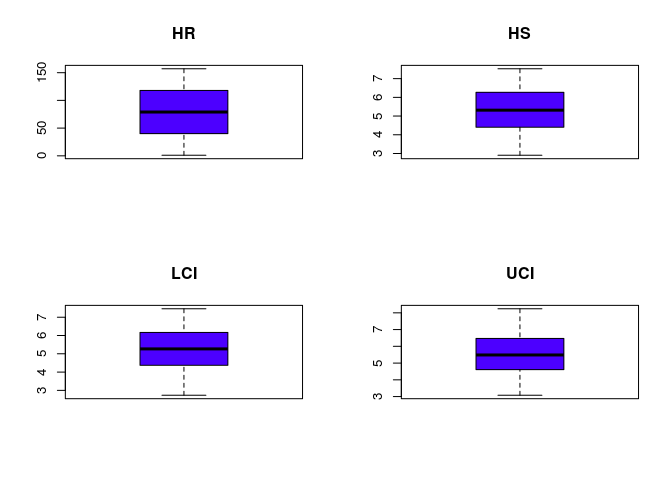

``` r
boxplot(mydata[,7], main=names(mydata)[7], col=topo.colors(n))
boxplot(mydata[,8], main=names(mydata)[8], col=topo.colors(n))
boxplot(mydata[,9], main=names(mydata)[9], col=topo.colors(n))
boxplot(mydata[,10], main=names(mydata)[10], col=topo.colors(n))
```

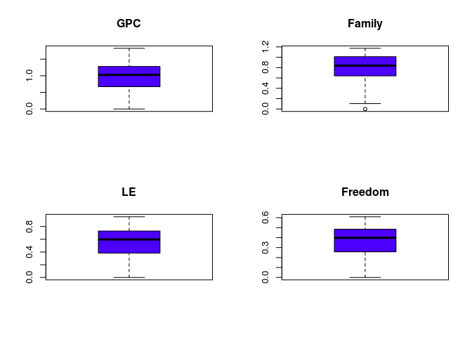

``` r
boxplot(mydata[,11], main=names(mydata)[11], col=topo.colors(n))
boxplot(mydata[,12], main=names(mydata)[12], col=topo.colors(n))
boxplot(mydata[,13], main=names(mydata)[13], col=topo.colors(n))
```

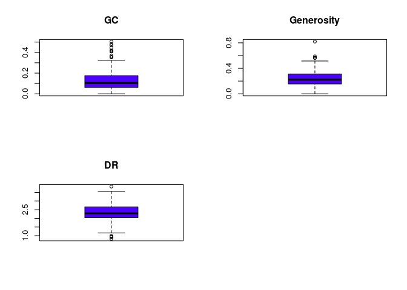

Quadre amb les estimacions
--------------------------

Realitzem un quadre amb les estimacions robustes i no robustes de tendència central i dispersió per a cada variable quantitativa:

``` r
mean.n <- as.vector(sapply(mydata[, 3:13], mean, na.rm = TRUE))
std.n <- as.vector(sapply(mydata[, 3:13], sd, na.rm = TRUE))
median.n <- as.vector(sapply(mydata[, 3:13], median, na.rm = TRUE))
mean.trim.0.05 <-
  as.vector(sapply(mydata[, 3:13], mean, na.rm = TRUE, trim = 0.05))
mean.winsor.0.05 <-
  as.vector(sapply(mydata[, 3:13], winsor.mean, na.rm = TRUE, trim = 0.05))
IQR.n <- as.vector(sapply(mydata[, 3:13], IQR, na.rm = TRUE))
mad.n <- as.vector(sapply(mydata[, 3:13], mad, na.rm = TRUE))


kable(
  data.frame(
    variables = names(mydata)[3:13],
    Media = mean.n,
    Mediana = median.n,
    Media.recort.0.05 = mean.trim.0.05,
    Media.winsor.0.05 = mean.winsor.0.05
  ),
  digits = 2,
  caption = "Estimaciones de Tendencia Central"
)
```

| variables  |  Media|  Mediana|  Media.recort.0.05|  Media.winsor.0.05|
|:-----------|------:|--------:|------------------:|------------------:|
| HR         |  79.00|    79.00|              79.00|              79.00|
| HS         |   5.38|     5.31|               5.38|               5.39|
| LCI        |   5.30|     5.27|               5.30|               5.31|
| UCI        |   5.54|     5.48|               5.54|               5.55|
| GPC        |   0.95|     1.03|               0.96|               0.96|
| Family     |   0.79|     0.84|               0.80|               0.79|
| LE         |   0.56|     0.60|               0.57|               0.56|
| Freedom    |   0.37|     0.40|               0.38|               0.37|
| GC         |   0.14|     0.11|               0.13|               0.13|
| Generosity |   0.24|     0.22|               0.24|               0.24|
| DR         |   2.33|     2.29|               2.33|               2.33|

``` r
kable(
  data.frame(
    variables = names(mydata)[3:13],
    Desv.Standard = std.n,
    IQR = IQR.n,
    MAD = mad.n
  ),
  digits = 2,
  caption = "Estimaciones de Dispersio"
)
```

| variables  |  Desv.Standard|    IQR|    MAD|
|:-----------|--------------:|------:|------:|
| HR         |          45.47|  78.00|  57.82|
| HS         |           1.14|   1.87|   1.37|
| LCI        |           1.15|   1.80|   1.34|
| UCI        |           1.16|   1.86|   1.44|
| GPC        |           0.41|   0.61|   0.43|
| Family     |           0.27|   0.37|   0.29|
| LE         |           0.23|   0.35|   0.25|
| Freedom    |           0.15|   0.23|   0.17|
| GC         |           0.11|   0.11|   0.08|
| Generosity |           0.13|   0.16|   0.12|
| DR         |           0.54|   0.63|   0.47|

------------------------------------------------------------------------

Valors perduts.
===============

------------------------------------------------------------------------

En la variable Família és on hi ha els valors perduts, podem veure que l'observació del valor perdut és la posició vuit, també com ja hem vist en les taules anteriors hi ha dos valors NA, el tercer i el setè.

``` r
v.p <-names(mydata)[!complete.cases(t(mydata))]
v.p
```

    ## [1] "Family"

``` r
# Family

v.p.p <- which(names(mydata)==v.p)
v.p.p
```

    ## [1] 8

Realitzem una imputació basada en KNN amb la distància Gover, assignat el valor calcular amb el KNN al grup de dades, en les posicions anteriors:

``` r
mydata.complet <- kNN(mydata[,8:13])

mydata[3,"Family"] <- mydata.complet[3,"Family"]
mydata[7:8,"Family"] <- mydata.complet[7:8,"Family"]
```

------------------------------------------------------------------------

Fer un breu estudi descriptiu de les dades una vegada depurades
===============================================================

------------------------------------------------------------------------

Gràfic de tartà per les variables descriptives, en aquest cas sols sobre regió, ja que països la freqüència és d'1 de cada país:

``` r
options(knitr.kable.NA = '')

kable(summary(mydata)[,c(1,2)],
      digits=2, caption="Estadística descriptiva de variables qualitatives nominals")
```

|     |      Country     |      Region      |
|-----|:----------------:|:----------------:|
|     |    Length:157    |    Length:157    |
|     | Class :character | Class :character |
|     |  Mode :character |  Mode :character |

``` r
library(plotrix)
```

    ## 
    ## Attaching package: 'plotrix'

    ## The following object is masked from 'package:psych':
    ## 
    ##     rescale

``` r
labelsTable <- paste(names(mydata$Region), "\n", mydata$Region, sep="") 
pie(table(factor(mydata$Region)),  labels = labelsTable, main="Despcripció atribut Regio", col=topo.colors(n))
```

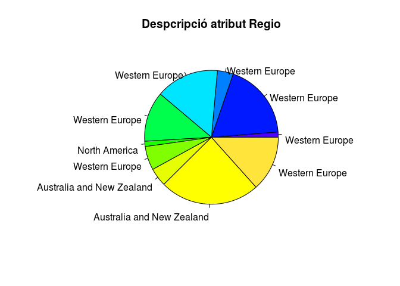

Realitzem 2 taules dels països amb més qualitat de felicitats i amb menys, ordenament des de mes a menys i mostrem els 5 registres principals:

``` r
kable(summary(mydata)[,c(3)],
      digits=2, caption="Estadística descriptiva de variables quantitativas discretes")
```

| x           |
|:------------|
| Min. : 1    |
| 1st Qu.: 40 |
| Median : 79 |
| Mean : 79   |
| 3rd Qu.:118 |
| Max. :157   |

``` r
#TOP 5 mes infeliços
head(mydata[order(mydata[, "HR"], decreasing = F), ][,c(1,3)], n=5)
```

    ##       Country HR
    ## 1     Denmark  1
    ## 2 Switzerland  2
    ## 3     Iceland  3
    ## 4      Norway  4
    ## 5     Finland  5

``` r
#TOP 5mes feliços
head(mydata[order(mydata[, "HR"], decreasing = T), ][,c(1,3)], n=5)
```

    ##         Country  HR
    ## 157     Burundi 157
    ## 156       Syria 156
    ## 155        Togo 155
    ## 154 Afghanistan 154
    ## 153       Benin 153

Sobre els atributs de variables quantitatives contínues creem diferents gràfics de barres:

``` r
kable(summary(mydata)[,c(4,5,6,7,8,9,10,11,12,13)],
      digits=2, caption="Estadística descriptiva de variables quantitativas contínues")
```

|     |       HS      |      LCI      |      UCI      |       GPC      |     Family     |       LE       |     Freedom    |        GC       |   Generosity   |       DR       |
|-----|:-------------:|:-------------:|:-------------:|:--------------:|:--------------:|:--------------:|:--------------:|:---------------:|:--------------:|:--------------:|
|     |  Min. :2.905  |  Min. :2.732  |  Min. :3.078  |  Min. :0.0000  |  Min. :0.0000  |  Min. :0.0000  |  Min. :0.0000  |  Min. :0.00000  |  Min. :0.0000  |  Min. :0.8179  |
|     | 1st Qu.:4.404 | 1st Qu.:4.371 | 1st Qu.:4.609 | 1st Qu.:0.6702 | 1st Qu.:0.6418 | 1st Qu.:0.3829 | 1st Qu.:0.2575 | 1st Qu.:0.06126 | 1st Qu.:0.1546 | 1st Qu.:2.0317 |
|     | Median :5.314 | Median :5.267 | Median :5.483 | Median :1.0278 | Median :0.8414 | Median :0.5966 | Median :0.3975 | Median :0.10547 | Median :0.2225 | Median :2.2907 |
|     |  Mean :5.382  |  Mean :5.298  |  Mean :5.543  |  Mean :0.9539  |  Mean :0.7935  |  Mean :0.5576  |  Mean :0.3710  |  Mean :0.13762  |  Mean :0.2426  |  Mean :2.3258  |
|     | 3rd Qu.:6.269 | 3rd Qu.:6.169 | 3rd Qu.:6.471 | 3rd Qu.:1.2796 | 3rd Qu.:1.0215 | 3rd Qu.:0.7299 | 3rd Qu.:0.4845 | 3rd Qu.:0.17554 | 3rd Qu.:0.3119 | 3rd Qu.:2.6646 |
|     |  Max. :7.526  |  Max. :7.460  |  Max. :8.241  |  Max. :1.8243  |  Max. :1.1728  |  Max. :0.9528  |  Max. :0.6085  |  Max. :0.50521  |  Max. :0.8197  |  Max. :3.8377  |

``` r
barplot(mydata$HS, col=terrain.colors(n))
title(main = "HS", font.main = 4)
```

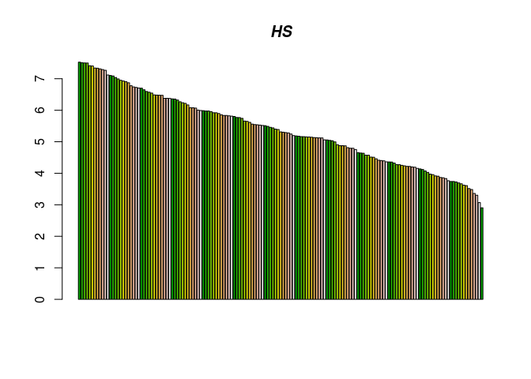

``` r
barplot(mydata$LCI, col=terrain.colors(n))
title(main = "LCI", font.main = 4)
```


``` r
barplot(mydata$UCI, col=terrain.colors(n))
title(main = "UCI", font.main = 4)
```


``` r
barplot(mydata$GPC, col=terrain.colors(n))
title(main = "GPC", font.main = 4)
```

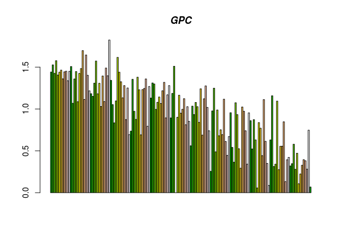

``` r
barplot(mydata$Family, col=terrain.colors(n))
title(main = "Family", font.main = 4)
```

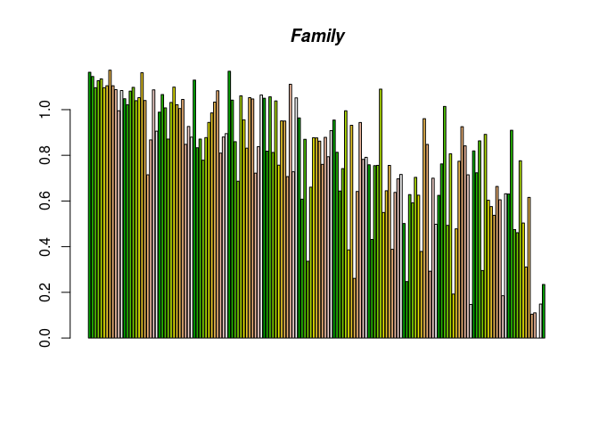

``` r
barplot(mydata$LE, col=terrain.colors(n))
title(main = "LE", font.main = 4)
```

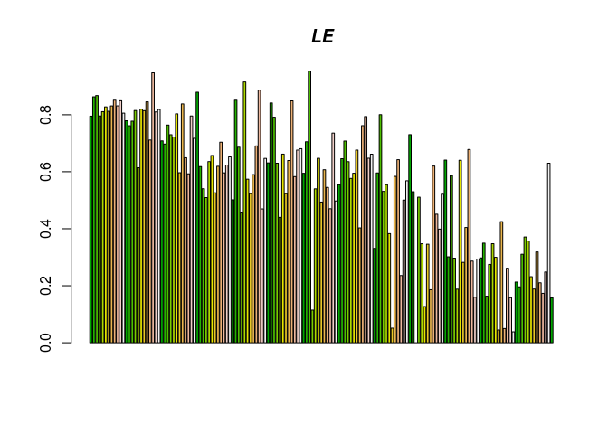

``` r
barplot(mydata$Freedom, col=terrain.colors(n))
title(main = "Freedom", font.main = 4)
```

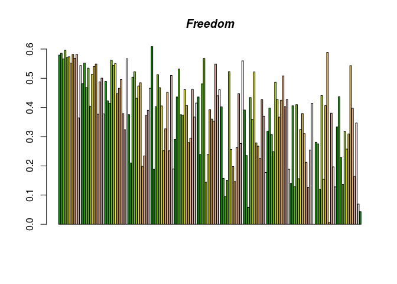

``` r
barplot(mydata$GC,col=terrain.colors(n))
title(main = "GC", font.main = 4)
```

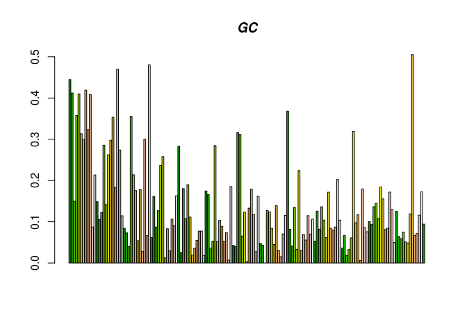

``` r
barplot(mydata$Generosity, col=terrain.colors(n))
title(main = "Generosity", font.main = 4)
```

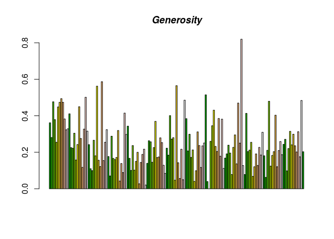

``` r
barplot(mydata$DR, col=terrain.colors(n))
title(main = "DR", font.main = 4)
```

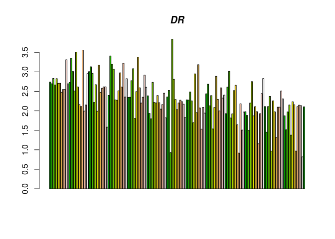

------------------------------------------------------------------------

Crear l’arxiu de dades corregit.
================================

------------------------------------------------------------------------

Finalment, creem l’arxiu de dades corregit, el guardem amb el nom 2016\_data\_procesed.csv:

``` r
write.csv2(mydata, file="2016_data_procesed.csv", row.names = FALSE)
```

------------------------------------------------------------------------

Bibliografia
============

------------------------------------------------------------------------

-   <http://www.r-chart.com/2010/06/color-palettes-in-r.html>
-   <https://www.statmethods.net/graphs/boxplot.html>
-   <https://vitalflux.com/data-science-scale-normalize-numeric-data-using-r/>
-   <https://rstudio-pubs-static.s3.amazonaws.com/123438_3b9052ed40ec4cd2854b72d1aa154df9.html>
-   <https://idc9.github.io/stor390/notes/cross_validation/cross_validation.html>
