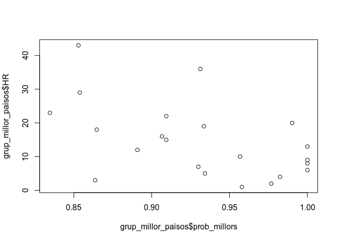
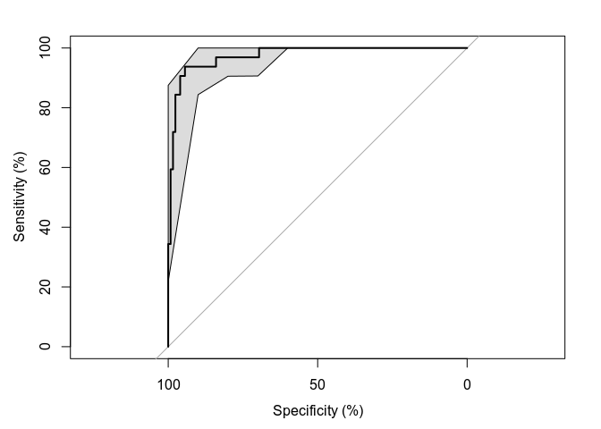

Carregar el fitxer de dades en R

Aquesta base de dades conté 157 registres i 13 variables. Les variables són Country, Region, HR, HS, LCI, UCI, GpC, Family, LE, Freedom, GC, Generosity i DR. Són les mateixes variables de l’activitat 1 i 2.

A l'obrir el fitxer amb la funció `read.csv2(file = "2016_clean.csv", header = TRUE, sep = ",", quote = "\"", dec = ",", fill = TRUE)`


```r
# Carregar el fitxer de dades en R
mydata <- read.csv2(file = "2016_clean.csv", header = TRUE, sep = ",", quote = "\"", dec = ".", fill = TRUE, encoding="UTF-8")
n.var <- names(mydata)
# breu resumen dels atributs
head(mydata, n=5)
```

<div class="kable-table">

Country       Region            HR      HS     LCI     UCI       GpC    Family        LE   Freedom        GC   Generosity        DR
------------  ---------------  ---  ------  ------  ------  --------  --------  --------  --------  --------  -----------  --------
Denmark       Western Europe     1   7.526   7.460   7.592   1.44178   1.16374   0.79504   0.57941   0.44453      0.36171   2.73939
Switzerland   Western Europe     2   7.509   7.428   7.590   1.52733   1.14524   0.86303   0.58557   0.41203      0.28083   2.69463
Iceland       Western Europe     3   7.501   7.333   7.669   1.42666   1.09610   0.86733   0.56624   0.14975      0.47678   2.83137
Norway        Western Europe     4   7.498   7.421   7.575   1.57744   1.12690   0.79579   0.59609   0.35776      0.37895   2.66465
Finland       Western Europe     5   7.413   7.351   7.475   1.40598   1.13464   0.81091   0.57104   0.41004      0.25492   2.82596

</div>

# Model de regressió lineal

Primerament, estudiarem com canvia el nivell de felicitat en funció d’algunes característiques de cada país.

## Model de regressió lineal múltiple (regressors quantitatius)

Estimar per mínims quadrats ordinaris amb un model lineal que expliqui la puntuació de felicitat (HS) d’un país en funció de tres factors quantitatius: l’indicador de renda per càpita (GpC), l’esperança de vida en salut (LE) i la corrupció (GC).

Mirar la bondat de l’ajust a través del coeficient de determinació ($R^2$). Podeu fer servir la comanda d’R lm.

## Estimació del model

```r
attach(mydata)
model_puntuacio_felicitat <- lm(HS~GpC+LE+GC, data=mydata)

#mostrem el resum del model per explicar la puntuacuñi de felicitat HS, en funció de GpC, LE i GC
summary(model_puntuacio_felicitat)
```

```
## 
## Call:
## lm(formula = HS ~ GpC + LE + GC, data = mydata)
## 
## Residuals:
##      Min       1Q   Median       3Q      Max 
## -2.24721 -0.36899 -0.00807  0.44560  1.66905 
## 
## Coefficients:
##             Estimate Std. Error t value Pr(>|t|)    
## (Intercept)   2.9832     0.1403  21.259  < 2e-16 ***
## GpC           1.2381     0.2300   5.382 2.72e-07 ***
## LE            1.7166     0.4085   4.203 4.47e-05 ***
## GC            1.8953     0.4829   3.924 0.000131 ***
## ---
## Signif. codes:  0 '***' 0.001 '**' 0.01 '*' 0.05 '.' 0.1 ' ' 1
## 
## Residual standard error: 0.6401 on 153 degrees of freedom
## Multiple R-squared:  0.6917,	Adjusted R-squared:  0.6856 
## F-statistic: 114.4 on 3 and 153 DF,  p-value: < 2.2e-16
```
El resultat de la bondat de l’ajust a través del coeficient de determinació ($R^2$), amb la comanda d’R lm, és 0.6916653

## Model de regressió lineal múltiple (regressors quantitatius i qualitatius)

Estimar per mínims quadrats ordinaris un model lineal que expliqui la puntuació de felicitat (HS) d’un país en funció de quatre factors. A part dels tres anteriors (renda, esperança de vida en salut i corrupció) ara s’afegeix la regió del món (region). Posar com a categoria de referència la regió “Western Europe” (per a fer això cal usar factor combinat amb relevel(region, ref = “Western Europe”)).

Mirar la bondat de l’ajust a través del coeficient de determinació ($R^2$) i comparar el resultat d’aquest model amb l’obtingut a l’apartat 1.1. Podeu fer servir la comanda d’R lm i usar el coeficient R-quadrat ajustat en la comparació. Interpreteu també el significat dels coeficients obtinguts i la seva significació.


```r
RwE = relevel(Region, ref = "Western Europe")
model_regresio_lineal<- lm(HS~GpC+LE+GC+factor(RwE), data=mydata )
summary(model_regresio_lineal)
```

```
## 
## Call:
## lm(formula = HS ~ GpC + LE + GC + factor(RwE), data = mydata)
## 
## Residuals:
##     Min      1Q  Median      3Q     Max 
## -1.8507 -0.2771  0.0293  0.3181  1.6751 
## 
## Coefficients:
##                                            Estimate Std. Error t value
## (Intercept)                                  3.6946     0.3746   9.864
## GpC                                          1.2713     0.2079   6.114
## LE                                           0.9290     0.4869   1.908
## GC                                           1.8168     0.4650   3.907
## factor(RwE)Australia and New Zealand         0.3902     0.4180   0.933
## factor(RwE)Central and Eastern Europe       -0.4024     0.1887  -2.132
## factor(RwE)Eastern Asia                     -0.6587     0.2642  -2.493
## factor(RwE)Latin America and Caribbean       0.3825     0.1963   1.948
## factor(RwE)Middle East and Northern Africa  -0.6231     0.1979  -3.149
## factor(RwE)North America                     0.5196     0.4134   1.257
## factor(RwE)Southeastern Asia                -0.2858     0.2516  -1.136
## factor(RwE)Southern Asia                    -0.5832     0.2959  -1.971
## factor(RwE)Sub-Saharan Africa               -0.6027     0.2890  -2.085
##                                            Pr(>|t|)    
## (Intercept)                                 < 2e-16 ***
## GpC                                        8.65e-09 ***
## LE                                         0.058409 .  
## GC                                         0.000143 ***
## factor(RwE)Australia and New Zealand       0.352166    
## factor(RwE)Central and Eastern Europe      0.034714 *  
## factor(RwE)Eastern Asia                    0.013792 *  
## factor(RwE)Latin America and Caribbean     0.053345 .  
## factor(RwE)Middle East and Northern Africa 0.001995 ** 
## factor(RwE)North America                   0.210841    
## factor(RwE)Southeastern Asia               0.257808    
## factor(RwE)Southern Asia                   0.050671 .  
## factor(RwE)Sub-Saharan Africa              0.038801 *  
## ---
## Signif. codes:  0 '***' 0.001 '**' 0.01 '*' 0.05 '.' 0.1 ' ' 1
## 
## Residual standard error: 0.558 on 144 degrees of freedom
## Multiple R-squared:  0.7795,	Adjusted R-squared:  0.7611 
## F-statistic: 42.43 on 12 and 144 DF,  p-value: < 2.2e-16
```

El coeficient de la bondat de l’ajust del primer model és 0.6916653 i del segon és 0.7795198. Per tant, podem dir que el segon model es millor i que la regió (Region) afecta significativament en el rank del Hapiness score.

Podem observar que els atributs GC i GpC son importants, és a dir significatius, hi ha països amb una Gpc (renta per capita) i amb corrupció alta (GC) influeixen amb el seu valor HS, o veiem amb el nivell de significança

## Efectuar una predicció de l’índex de felicitat amb els dos models

Suposar un país de la regió d’Europa Occidental (Western Europe), amb una renda de 1.5, una esperança de vida en salut del 69% i un índex ed corrupció de 0.35 i fer la predicció amb els dos models. Interpretar els resultats.


```r
predict_data = data.frame(Region = "Western Europe", GpC=1.5, LE=0.69, GC=0.35)
predict_data_primer_model = predict(model_puntuacio_felicitat, predict_data)
predict_data_primer_model
```

```
##        1 
## 6.688089
```


```r
predict_data = data.frame(RwE = "Western Europe", GpC=1.5, LE=0.69, GC=0.35)
predict_data_segon_model = predict(model_regresio_lineal, predict_data)
predict_data_segon_model
```

```
##        1 
## 6.878392
```

Pel que fa el primer models index de fecilitat seria 6.6880893 per al primer model i 6.8783921 per al segon.

Podem veure que que l'index de felicitat de la regió d’Europa Occidental és unes dècimes superior en el segon model, ja havíem vist en la regressions anteriors.

# Model de regressió logística

Es vol mirar el fenòmen de la felicitat des d’un punt de vista del quins són els 32 països més feliços del món. Per tant es mirarà la probabilitat que un país estigui en aquest grup. Per a avaluar aquesta probabilitat farem un model de regressió logística on la variable dependent serà una variable binària que indicarà si el país te un lloc al rànking de les millors posicions fins a la 32 (inclosa). Aquesta variable s’anomenarà “best” i usarem la mostra disponible per a estimar el model amb les mateixes variables que al model 1.1.

## Estimació d’un model de regressió logística

Estimar el model de regressió logística on la variable dependent és “best”(definida anteriorment) i les explicatives són l’indicador de renda per càpita (GpC) i la corrupció (GC). 

No volem posar l’esperança de vida perquè pensem que ja queda prou representada la riquesa per la renda per càpita. Mirar si hi ha algun dels regressors que té influència significativa (p-valor del contrast individual inferior al 5%).


```r
best=(mydata$HR<=32) #32 països més feliços del món
summary(best)
```

```
##    Mode   FALSE    TRUE 
## logical     125      32
```
Podem veure la variable binaria del 32 paisos mes feliços (TRUE) i la resta FALSE.

Realitzem del model:

```r
model_regresio_logistica = glm(best~GpC+GC, family=binomial, data=mydata)
summary(model_regresio_logistica)
```

```
## 
## Call:
## glm(formula = best ~ GpC + GC, family = binomial, data = mydata)
## 
## Deviance Residuals: 
##      Min        1Q    Median        3Q       Max  
## -2.83199  -0.49261  -0.23772  -0.06886   2.28740  
## 
## Coefficients:
##             Estimate Std. Error z value Pr(>|z|)    
## (Intercept)   -7.955      1.489  -5.342 9.21e-08 ***
## GpC            4.934      1.266   3.899 9.67e-05 ***
## GC             6.131      2.547   2.407   0.0161 *  
## ---
## Signif. codes:  0 '***' 0.001 '**' 0.01 '*' 0.05 '.' 0.1 ' ' 1
## 
## (Dispersion parameter for binomial family taken to be 1)
## 
##     Null deviance: 158.776  on 156  degrees of freedom
## Residual deviance:  92.851  on 154  degrees of freedom
## AIC: 98.851
## 
## Number of Fisher Scoring iterations: 6
```

En el resum (summary) observem que la renda per càpita o Gpc i la corrupció o GC són atributs significatius per al grup de 32 països mes feliços.

## Predicció en el model lineal generalitzat (model de regressió logística)

Usant el model anterior, calculeu la probabilitat de ser un dels 32 països més feliços del món per un país que té una renda de 1.5, i un índex de corrupció de 0.35.


```r
predict_data = data.frame(RwE = "Western Europe", GpC=1.5, GC=0.35)
predicio_32 = predict(model_regresio_logistica, predict_data, type="response")
predicio_32
```

```
##         1 
## 0.8308787
```

Tal com es podia esperar, la possibilitat és alta, en aquest cast la predicció és 0.8308787.

## Millora del model

Buscar un millor model a l’anterior posant-hi més variables explicatives. Proveu tres models regressors:

* Model regressor que afegeix a l’anterior la variable llibertat (Freedom).
* Model regressor que afegeix la regió.
* Model regressor que afegeix llibertat i regió.

Decidiu si prefereix el model inicial, el que té freedom, el que té regió o el que les té les dues. El criteri per decidir que el model ha millorat és el criteri AIC (amb les variables inicials del model 2.1 i el model actual que té una variable més). Com més petit és l’AIC millor és el model.

### Model amb Freedom

```r
model_freedom = glm(best~GpC+GC+Freedom, family=binomial, data=mydata)
summary(model_freedom)
```

```
## 
## Call:
## glm(formula = best ~ GpC + GC + Freedom, family = binomial, data = mydata)
## 
## Deviance Residuals: 
##      Min        1Q    Median        3Q       Max  
## -2.70153  -0.37097  -0.11772  -0.01567   2.23014  
## 
## Coefficients:
##             Estimate Std. Error z value Pr(>|z|)    
## (Intercept) -13.0141     2.6107  -4.985  6.2e-07 ***
## GpC           4.9801     1.3959   3.568  0.00036 ***
## GC           -0.2696     3.2968  -0.082  0.93483    
## Freedom      13.5523     4.1887   3.235  0.00121 ** 
## ---
## Signif. codes:  0 '***' 0.001 '**' 0.01 '*' 0.05 '.' 0.1 ' ' 1
## 
## (Dispersion parameter for binomial family taken to be 1)
## 
##     Null deviance: 158.776  on 156  degrees of freedom
## Residual deviance:  76.912  on 153  degrees of freedom
## AIC: 84.912
## 
## Number of Fisher Scoring iterations: 7
```

### Model amb Region

```r
model_region = glm(best~GpC+GC+Region, family=binomial, data=mydata)
summary(model_region)
```

```
## 
## Call:
## glm(formula = best ~ GpC + GC + Region, family = binomial, data = mydata)
## 
## Deviance Residuals: 
##      Min        1Q    Median        3Q       Max  
## -2.36527  -0.20182  -0.00012  -0.00001   2.93361  
## 
## Coefficients:
##                                         Estimate Std. Error z value
## (Intercept)                               6.1209 12454.7280   0.000
## GpC                                       8.2718     3.0782   2.687
## GC                                        7.6260     4.2669   1.787
## RegionCentral and Eastern Europe        -19.7319 12454.7274  -0.002
## RegionEastern Asia                      -39.6944 13894.2411  -0.003
## RegionLatin America and Caribbean       -16.0506 12454.7274  -0.001
## RegionMiddle East and Northern Africa   -22.1407 12454.7274  -0.002
## RegionNorth America                       0.5038 17471.4984   0.000
## RegionSoutheastern Asia                 -20.3752 12454.7277  -0.002
## RegionSouthern Asia                     -33.9308 13870.8214  -0.002
## RegionSub-Saharan Africa                -33.9546 12654.5690  -0.003
## RegionWestern Europe                    -18.1504 12454.7273  -0.001
##                                       Pr(>|z|)   
## (Intercept)                             0.9996   
## GpC                                     0.0072 **
## GC                                      0.0739 . 
## RegionCentral and Eastern Europe        0.9987   
## RegionEastern Asia                      0.9977   
## RegionLatin America and Caribbean       0.9990   
## RegionMiddle East and Northern Africa   0.9986   
## RegionNorth America                     1.0000   
## RegionSoutheastern Asia                 0.9987   
## RegionSouthern Asia                     0.9980   
## RegionSub-Saharan Africa                0.9979   
## RegionWestern Europe                    0.9988   
## ---
## Signif. codes:  0 '***' 0.001 '**' 0.01 '*' 0.05 '.' 0.1 ' ' 1
## 
## (Dispersion parameter for binomial family taken to be 1)
## 
##     Null deviance: 158.776  on 156  degrees of freedom
## Residual deviance:  53.658  on 145  degrees of freedom
## AIC: 77.658
## 
## Number of Fisher Scoring iterations: 19
```

### Model amb Freedom i Region

```r
model_freedom_region = glm(best~GpC+GC+Freedom+Region, family=binomial, data=mydata)
summary(model_freedom_region)
```

```
## 
## Call:
## glm(formula = best ~ GpC + GC + Freedom + Region, family = binomial, 
##     data = mydata)
## 
## Deviance Residuals: 
##      Min        1Q    Median        3Q       Max  
## -2.31400  -0.16706  -0.00012   0.00000   2.90244  
## 
## Coefficients:
##                                         Estimate Std. Error z value
## (Intercept)                               3.7573 12441.1541   0.000
## GpC                                       8.0135     3.1023   2.583
## GC                                        3.6018     4.9107   0.733
## Freedom                                   7.3467     4.4533   1.650
## RegionCentral and Eastern Europe        -19.4103 12441.1534  -0.002
## RegionEastern Asia                      -39.2569 13909.2312  -0.003
## RegionLatin America and Caribbean       -16.2274 12441.1534  -0.001
## RegionMiddle East and Northern Africa   -21.6647 12441.1534  -0.002
## RegionNorth America                       0.3024 17444.7276   0.000
## RegionSoutheastern Asia                 -19.9136 12441.1535  -0.002
## RegionSouthern Asia                     -34.2730 13706.5296  -0.003
## RegionSub-Saharan Africa                -33.8695 12626.3720  -0.003
## RegionWestern Europe                    -18.0431 12441.1533  -0.001
##                                       Pr(>|z|)   
## (Intercept)                            0.99976   
## GpC                                    0.00979 **
## GC                                     0.46327   
## Freedom                                0.09900 . 
## RegionCentral and Eastern Europe       0.99876   
## RegionEastern Asia                     0.99775   
## RegionLatin America and Caribbean      0.99896   
## RegionMiddle East and Northern Africa  0.99861   
## RegionNorth America                    0.99999   
## RegionSoutheastern Asia                0.99872   
## RegionSouthern Asia                    0.99800   
## RegionSub-Saharan Africa               0.99786   
## RegionWestern Europe                   0.99884   
## ---
## Signif. codes:  0 '***' 0.001 '**' 0.01 '*' 0.05 '.' 0.1 ' ' 1
## 
## (Dispersion parameter for binomial family taken to be 1)
## 
##     Null deviance: 158.776  on 156  degrees of freedom
## Residual deviance:  50.434  on 144  degrees of freedom
## AIC: 76.434
## 
## Number of Fisher Scoring iterations: 19
```

Segons la variable AIC, el model, amb la variable dependent "best", ha millorat en cada variable explicativa que hem agregat, d'altra banda, hem vist que és més influyen la variable regió que el grau de llibertat.

* AIC del model incial: 98.8506937.
* Model amb l'agregació de la variable explicatica Freedom: 84.9118677.
* Model amb l'agregació de la variable explicatica Region: 77.6580996.
* Model amb l'agregació de les variable explicatica Region i Freedom: 76.4340474.

Per tant, el model amb l'AIC més petit que correspon al millor és el que hem agregat els dos paràmetres, a més podem veure que l'agregació de variables redueix el nivell de significació de totes les variables explicatives.


## Qualitat de l’ajust

Feu la matriu de confusió del millor model de l’apartat 2.3 suposant un llindar de discriminació del 80%. Mireu quants falsos negatius hi ha i interpreteu què vol dir que siguin falsos negatius.

### Matriu de confusió

```r
prob_matriu = predict(model_freedom_region, mydata, type="response")
pred_mes_feliços <- ifelse(prob_matriu > 0.8, TRUE, FALSE)
table(best, pred_mes_feliços)
```

```
##        pred_mes_feliços
## best    FALSE TRUE
##   FALSE   123    2
##   TRUE     12   20
```

En aquest cas tenim 12 falsos negatius (fn) que corresponen on no estan en el grup dels 32 països més feliços i el model predictiu els ha classificat en aquest grup.

Generem una taula per veure-ho més clarament:

### Taula de TP, TN, FP i FN

```r
performance_data<-data.frame(observed = best, predicted = pred_mes_feliços)
tp<-sum(performance_data$observed==TRUE & performance_data$predicted==TRUE)
tn<-sum(performance_data$observed==FALSE & performance_data$predicted==FALSE)
fp<-sum(performance_data$observed==FALSE & performance_data$predicted==TRUE)
fn<-sum(performance_data$observed==TRUE & performance_data$predicted==FALSE)
data.frame(tp,tn,fp,fn)
```

<div class="kable-table">

 tp    tn   fp   fn
---  ----  ---  ---
 20   123    2   12

</div>
### Taula de predició

```r
total <- nrow(performance_data)
positive <- sum(performance_data$observed==TRUE)
negative <- sum(performance_data$observed==FALSE)
predicted_positive <- sum(performance_data$predicted==TRUE)
predicted_negative <- sum(performance_data$predicted==FALSE)
total <- nrow(performance_data)
data.frame(positive, negative, predicted_positive, predicted_negative)
```

<div class="kable-table">

 positive   negative   predicted_positive   predicted_negative
---------  ---------  -------------------  -------------------
       32        125                   22                  135

</div>
### Taula de precisió i ratio d'errors

```r
accuracy <- (tp+tn)/total
error_rate <- (fp+fn)/total
sensitivity <- tp/positive
especificity <- tn/negative
precision <- tp/predicted_positive
npv <- tn / predicted_negative
data.frame(accuracy,error_rate,sensitivity,especificity,precision,npv)
```

<div class="kable-table">

 accuracy   error_rate   sensitivity   especificity   precision         npv
---------  -----------  ------------  -------------  ----------  ----------
 0.910828     0.089172         0.625          0.984   0.9090909   0.9111111

</div>

## La selecció dels millors països

Establiu un nivell de probabilitat (llindar de discriminació a partir el qual penseu que el país té moltes possibilitats de ser entre els millors, per exemple podeu triar 80% com abans). Compareu el nivell de probabilitat que dóna el model amb el ranking del país i identifiqueu països que no s’han comportat segons l’esperat. Podeu fer aquesta comparació gràficament.


```r
mydata$prob_millors=predict(model_freedom_region, mydata, type="response")
grup_millor_paisos=subset(mydata, prob_matriu>0.8)
plot(grup_millor_paisos$prob_millors, grup_millor_paisos$HR)
```

<!-- -->

Els països que no s'han comportat com s'espera són tots aquells de la part inferior de la gràfica, on entre 80% i 100% de possibilitats de ser països del grup dels 35 millors amb el rang de felicitat, però realment tenen un HR molt baix.

## Corba ROC

Feu el dibuix de la corba ROC (podeu usar la llibreria pROC i la comanda roc i el plot de l’objecte resultant). Calculeu l’AUROC usant també aquest paquet, auc(...) on heu de posat el nom de l’objecte roc. Interpreteu el resultat.

Hem seleccionat el vector dels valors reals amb la variable best i el vector de probabilitats predites pel millor model, per obtenir la corba ROC i veure la qualitat de la predicció:

```r
corba_roc = roc(best, mydata$prob_millors, partial.auc.correct = TRUE, percent = TRUE , ci = TRUE, of = "se", colorize=TRUE, probability = TRUE)

plot(x = corba_roc, ci.type="shape", lwd=2, colorize=TRUE)
```

```
## Warning in plot.ci.se(x$ci, type = "shape", col = ci.col, no.roc = TRUE, :
## Low definition shape.
```

<!-- -->

La corba ROC és un gràfic per avaluar la bondat d'ajut en la regressió logística, cada punt de la corba correspon a un nivell llindar de discriminació en la matriu de confusió.

El millor model és aquell que té una corba ROC el més prop possible de la cantonada superior esquerra del gràfic. En aquest com podem veure que s'ajusta bastant a la cantonada superior esquerra és un model predictiu que discrimina bé.


```r
resultat_auoc = auc(corba_roc)
resultat_auoc
```

```
## Area under the curve: 97.42%
```

Per tenir una regla objectiva de comparació de les corbes ROC, es calcula l'àrea situada entre la corba i la diagonal, anomenada simplement AUROC. El valor mes alt correspon al millor model, en aquest el resultat de l'AUROC és 97.425, sense dubte és un bon model.


# Referencias

* Multiple (Linear) Regression: https://www.statmethods.net/stats/regression.html
* Regresió lineal: http://www.r-tutor.com/elementary-statistics/logistic-regression/significance-test-logistic-regression
* pRoc Documentation: https://www.rdocumentation.org/packages/pROC/versions/1.11.0/topics/pROC-package
* ROC Analysis: http://mlwiki.org/index.php/ROC_Analysis
